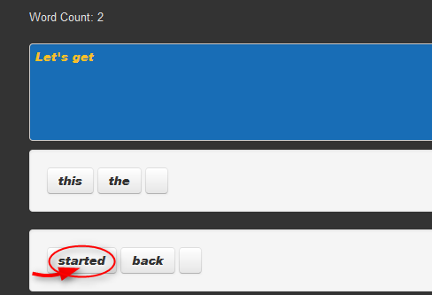
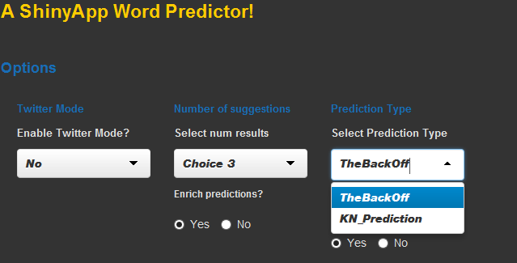
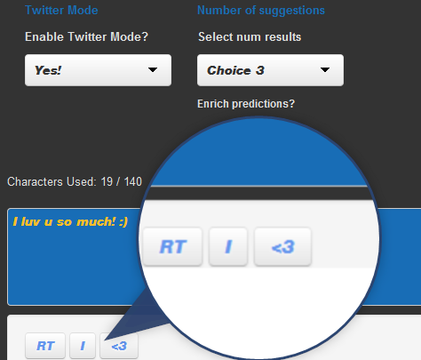

<style>
.title-slide { background-color: #186DB6;}
.title-slide hgroup > h1{ font-family: 'Helvetica', 'Helvetica', sanserif; }
.title-slide hgroup > h1 { color: #FABF29; } 
.title-slide hgroup > h2 { color: #dfdfdf }
.title-slide hgroup > p { color: #dfdfdf ;}
</style>

## The App

Free to use and runs right in the browser, using Html5, Shiny and R.


- Just type 
- Point 
- Click!


Word Predictions        |  User Options! | Twitter mode/tweet vocab | 
:-------------------------:|:-------------------------:|:-------------------------:|
 |   |  |


Grab it here: [https://sepanda.shinyapps.io/ShinyWordPredictor/](https://sepanda.shinyapps.io/ShinyWordPredictor/)

--- .class #id 

## How it works

- The app uses two different data sets. One for general purpose predictions and another for Twitter predictions.
- General predictions are made by extracting info using a fancy bit of Google inspired regex!


```r
theGpattern <- "[A-GJXa-gjx]#|([£\\$])?[0-9.]+|[a-zA-Z&_0-9]+('[stdm]|('ve)|('ll)|('re))?\\+*|[-\\.@!%\\*\\(\\)=\\{\\}\\|:;,><\\?/~`'#+£\\$\"]"
```

- The user input is then processed, using a "Stupid backoff" or "Knesser-Ney" algorithm, picking out the highest and most relevant predictions based on preprocessed data from [HC Corpora](http://www.corpora.heliohost.org/) data sets.

- Tweets get their own special word processing. Why? Punctuation in Tweets can often mean more than the words around them. 

```r
TweetText <- "NLP makes me :) I <3 it!" 
```
Solution? Treat groups of punctuation, letters and numbers as words in their own right!


--- .class #id 

## How well does it do?

The training scheme involved 70% of the entire data set, the following is based on random sampling of the remaining 30% of the data. 

The fitness test against random samples of the held out test data yielded the following (averaged) values. 

| Testing |Alogrithm| Number of predicted words | success rate |
|:------- |:---------|:-----------|:-----------|
| Twitter |Backoff  |    1    | 14.7 % |
|         |Backoff  |    2    | 19.2 % |
|         |Backoff  |    3    | 23.2 % | 
|Blog/News|Backoff  |    1    | 18.8 % |
|         |Backoff  |    2    | 28.3 % | 
|         |Backoff  |    3    | 34.1 % | 
|Blog/News|Kneser-Ney  |    1    | 15 % |
|         |Kneser-Ney  |    2    | 21.8 % | 
|         |Kneser-Ney  |    3    | 27.5 % | 


--- .class #id 

## Thanks for your time.!

Instructions for using the app can be found within the app itself!  

- Just start typing in the text box 
- Point at a prediction and click! 

It's fun, it's free!

The app:
[https://sepanda.shinyapps.io/ShinyWordPredictor/](https://sepanda.shinyapps.io/ShinyWordPredictor/)

My github:
[https://github.com/sepanda](https://github.com/sepanda)

More about me:
- [sepanda.com/About](http://sepanda.com/about/)
- [linkedIn](http://linkedin.com/in/sepandapouryahya/)


